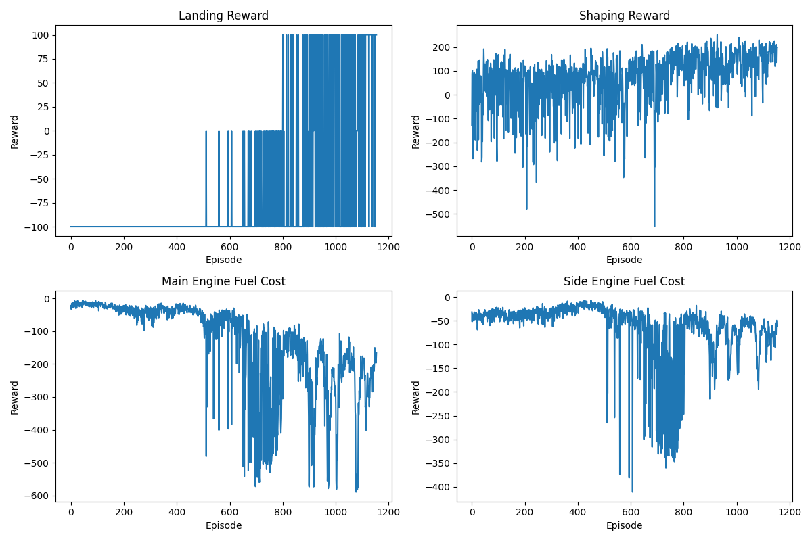
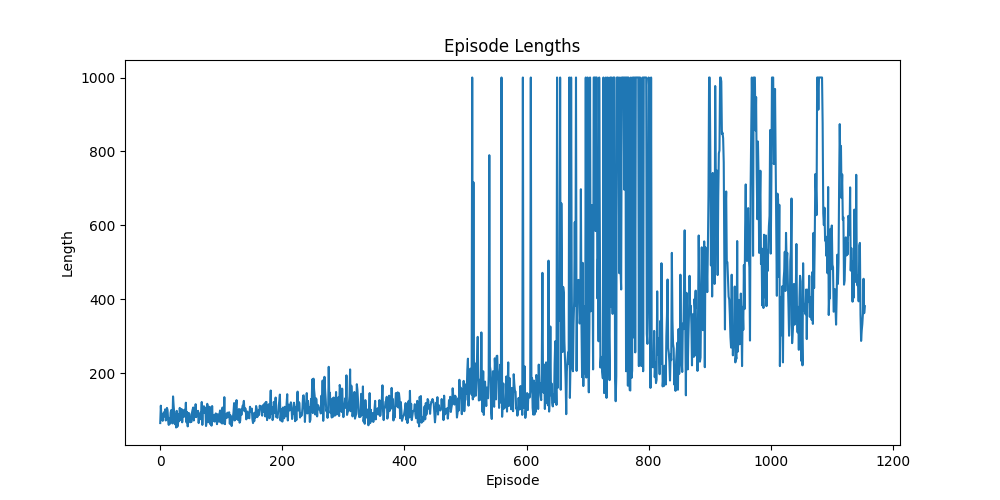

# Multi-Objective Lunar Lander with PPO

## AI Lab Course Project

### Project Overview

This project implements a Multi-Objective Proximal Policy Optimization (PPO) algorithm to train an agent to land a lunar module in the "Lunar Lander" environment from OpenAI Gym. The environment has been modified to include multiple objectives, making it a more complex and realistic scenario.

### Features

- Implementation of PPO algorithm for multi-objective reinforcement learning
- Custom ActorCritic network architecture
- Training and evaluation scripts
- Performance visualization

### Requirements

- Python 3.7+
- PyTorch
- Gymnasium
- MO-Gymnasium
- Matplotlib
- NumPy
- Box2D
- Swig

### Installation

1. Clone this repository:

`git clone https://github.com/Adityavats421/moon-lander-ppo.git`

`cd mo-lunar-lander-ppo`

2. Install the required packages:

`pip install torch numpy matplotlib gymnasium mo-gymnasium box2d swig`

### Usage

To train the agent:

`python x.py`

This will start the training process and save the trained model as `mo_lunar_lander_ppo.pth`. It will also generate performance plots.

### Results

The training process generates two plots:

1. Rewards per episode for each objective:

2. Episode lengths over time:

### Project Structure

- `x.py`: Main script containing the PPO implementation, training loop, and evaluation functions
- `mo_lunar_lander_ppo.pth`: Saved model weights (generated after training)
- `mo_lunar_lander_rewards.png`: Plot of rewards for each objective
- `mo_lunar_lander_lengths.png`: Plot of episode lengths
- `videos/`: Directory containing recorded evaluation episodes (generated during evaluation)

### Proximal Policy Optimization

This code implements a custom version of the Proximal Policy Optimization [PPO](https://openai.com/index/openai-baselines-ppo/) algorithm, but it is not directly using OpenAI's implementation. Here are the key points:

1.  The code defines a PPO class that implements the core components of the PPO algorithm.
2.  It uses an ActorCritic neural network architecture, which is common in PPO implementations.
3.  The algorithm includes key PPO features such as:
    - Clipped surrogate objective (eps_clip)
    - Multiple epochs of optimization (K_epochs)
    - Separate old and current policies
4.  The implementation is adapted for multi-objective reinforcement learning, handling multiple reward components.
5.  While it follows the general principles of PPO, this is a custom implementation tailored for the multi-objective Lunar Lander environment, not OpenAI's specific implementation.

### Multi-Objective Approach

This project tackles the Lunar Lander problem with four objectives:

1. Landing reward
2. Shaping reward
3. Main engine fuel cost
4. Side engine fuel cost

The PPO algorithm is adapted to handle these multiple objectives, providing a more nuanced and realistic approach to the landing task.

### Future Improvements

- Implement Pareto front visualization for multi-objective trade-offs
- Experiment with different network architectures
- Add support for continuous action space
- Implement other multi-objective RL algorithms for comparison

### Contributors

- [Haneesh Kenny](https://github.com/imkenough)
- [Aditya Vats](https://github.com/Adityavats421)

### Acknowledgments

- OpenAI Gym for the base Lunar Lander environment [Gymnasium](https://gymnasium.farama.org/)
- MO-Gymnasium for the multi-objective version of the environment [Gymnasium](https://mo-gymnasium.farama.org/)
- custom Implementation of the PPO; Proximal Policy Optimization algrotihm from OpenAI [PPO](https://openai.com/index/openai-baselines-ppo/)
